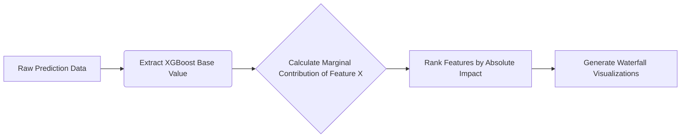

# Supply Prescript XAI 

An enterprise-grade Explainable AI (XAI) module that translates complex Machine Learning predictions into actionable business insights for logistics and supply chain optimization.

## How XAI Improves Trust & Decision Making
In logistics, "black box" AI models predicting a 14-day delay are useless to a dispatcher if they don't know *why*. Explainable AI (via SHAP) demystifies the predictive engine by assigning exact contribution values to every feature.

This allows the prescriptive engine to target the **root cause** of the problem, rather than just reacting to the symptom. By generating human-readable business translations, stakeholders can trust the system, easily validate its findings against real-world operations, and execute optimized recommendations with high confidence.

## Architecture

```mermaid
graph TD
    A[Supply Chain Data] --> B[XGBoost Predictor]
    B --> C[Prediction Output: Delay Mins]
    B --> D[SHAP Explainer]
    D --> E[Local Feature Contributions]
    
    E --> F[Business Translation Engine]
    F --> G["Why Panel" (Human Readable Text)]
    
    E --> H[Prescriptive Optimization Engine]
    H --> I[Targeted Recommendation]
    I --> J[Before vs After ROI Analysis]
    
    G --> K[React / Plotly Interactive UI]
    J --> K
    C --> K
```

## SHAP Pipeline



## API Documentation

The FastAPI backend exposes the following endpoints (default `http://localhost:8001`):

- `GET /prediction-explanation/{shipment_id}`
  Returns the exact predicted delay, probability, business translation text, and top 10 contributing features ranked by impact.
  
- `GET /feature-importance`
  Returns the globally aggregated feature importance across the entire dataset.
  
- `GET /recommendation-explanation/{shipment_id}`
  Executes the prescriptive recommendation engine to output expected cost, delay reduction, and overall ROI for a specific action.
  
- `GET /confidence-score/{shipment_id}`
  Returns system confidence indicators (Model, Prediction, Recommendation).
